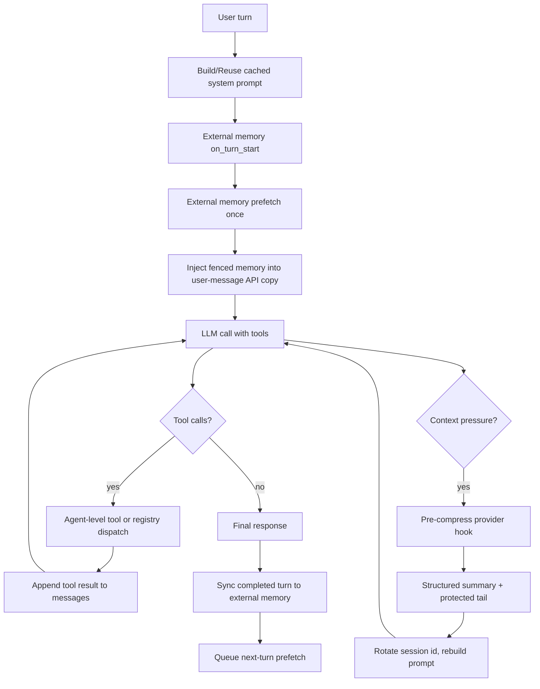

# Hermes memory 收斂與濃縮章

本章專門整理 Hermes 的記憶與 context compression：記憶如何進入 prompt、何時同步、如何在長上下文中收斂，以及哪些上限會影響可解釋性。範圍同樣只含 lab trace 與 production source 只讀觀察。

## SOUL 與身份來源

Hermes identity 有明確優先序：

- `run_agent.py:5825-5833` 優先載入 `SOUL.md` 作為 primary identity。
- `run_agent.py:5835-5838` 若沒有 SOUL 內容，才使用 `DEFAULT_AGENT_IDENTITY`。
- `agent/prompt_builder.py:134-142` 預設 identity 內容為 Hermes Agent，由 Nous Research 建立，要求 helpful、knowledgeable、direct、targeted、efficient。
- README 也把 `SOUL.md` 列為 persona file，與 memories、workspace instructions 同列為可遷移狀態。

因此，SOUL 是「身份層」而非普通 user message。它會進 system prompt 的 stable tier，對整個 session 生效。對 M1/M2 的白箱觀察而言，應把 SOUL 視為 system prompt 前段的可變入口，與 `AGENTS.md`/memory 分開記錄。

## 內建 memory 的收斂方式

內建 memory 是 curated、bounded、file-backed：

- `tools/memory_tool.py:5-9` 定義兩個 store：`MEMORY.md` 放環境、專案慣例、工具 quirks、learned facts；`USER.md` 放使用者偏好、溝通方式、工作習慣。
- `tools/memory_tool.py:11-14` 說明兩者在 session start 注入 system prompt；mid-session write 只更新檔案，不改當前 system prompt。
- `tools/memory_tool.py:16-23` 使用 entry delimiter 與字元上限；工具 schema 內含行為 guidance。
- `tools/memory_tool.py:107-124` MemoryStore 同時維護 live entries 與 frozen system prompt snapshot。
- `tools/memory_tool.py:126-142` `load_from_disk()` 讀取、去重，並 capture frozen snapshot。
- `tools/memory_tool.py:361-372` `format_for_system_prompt()` 回傳 snapshot，不讀 live state。

這個設計的收斂特性是：模型可以在本輪透過 memory tool 寫入 durable fact，但當前 session 的 system prompt 不會立即改變。這降低 prefix cache 破壞與 prompt drift；代價是新寫入的記憶要到下一個 session start，或 prompt 被 compression 後重建時，才會成為 system prompt snapshot 的一部分。

## 上限與拒寫

內建 memory 以字元而非 token 控制容量：

- `run_agent.py:1975-1980` 從 config 讀 `memory_char_limit` 與 `user_char_limit`，預設分別是 2,200 與 1,375 chars。
- `tools/memory_tool.py:118-122` MemoryStore 以同樣預設初始化。
- `tools/memory_tool.py:224-267` add 時會計算新增後總長，超過 limit 就拒絕並要求 replace/remove。
- `tools/memory_tool.py:269-325` replace 同樣檢查 replacement 後總長。
- `tools/memory_tool.py:393-409` system prompt block 會顯示使用率與目前字元數。

這個上限讓 memory 能收斂在短 fact list，而不是逐漸變成第二份 transcript。對可解釋性而言，重要觀察點是「被拒寫的內容」與「replace/remove 的 old_text」，因為它們會揭露模型如何選擇保留哪些長期事實。

## 安全掃描與 prompt injection 防護

Hermes 在兩個入口做掃描：

- Context files：`agent/prompt_builder.py:31-47` 定義 `_CONTEXT_THREAT_PATTERNS`，針對 `AGENTS.md`、`.cursorrules`、`SOUL.md` 等進行 prompt injection/exfiltration 檢查；`agent/prompt_builder.py:55-73` 若命中就以 blocked marker 替代內容。
- Memory entries：`tools/memory_tool.py:62-83` 定義 `_MEMORY_THREAT_PATTERNS`；`tools/memory_tool.py:92-104` 命中 invisible unicode 或 injection/exfiltration pattern 時拒寫。

這表示 memory 不是無條件可把任意文字升格為 system prompt。對 M4（prompt/trace faithfulness）而言，這些 blocked markers 也是可觀察輸入，應與正常 memory entries 分開標註。

## External memory provider lifecycle

Hermes 另有 external memory provider 架構：

- `agent/memory_provider.py:15-22` lifecycle：initialize、system_prompt_block、prefetch、sync_turn、get_tool_schemas、handle_tool_call、shutdown。
- `agent/memory_provider.py:24-30` optional hooks：turn start、session end、session switch、pre-compress、memory write、delegation。
- `agent/memory_manager.py:190-249` MemoryManager 管理 providers，且只允許一個 non-builtin provider，避免 tool schema bloat 與 backend 衝突。
- `run_agent.py:1987-2048` 由 `memory.provider` config 選擇 external provider，初始化時帶 session、platform、HERMES_HOME、gateway user/chat/thread/profile scope。
- `run_agent.py:2050-2069` external provider 的 tool schemas 會加入 model tool surface，並用 name 去重。

External provider 走「每 turn recall + completed turn sync」：

- `run_agent.py:12089-12097` turn start 先通知 provider。
- `run_agent.py:12099-12110` prefetch 只做一次，結果存在 `_ext_prefetch_cache`。
- `run_agent.py:12260-12277` prefetch 結果用 `<memory-context>` fence 附在本輪 user message 的 API copy 後面。
- `run_agent.py:5608-5652` completed turn 後呼叫 `sync_all()` 與 `queue_prefetch_all()`；interrupted turn 直接跳過。
- `agent/memory_manager.py:285-302` prefetch failures non-fatal。
- `agent/memory_manager.py:317-327` sync failures warning，但不阻斷使用者回覆。

這層 memory 的收斂比較像 retrieval-augmented background context：它不固定在 system prompt 中，而是在每 turn 針對 query 回灌。Hermes 用 fence 與 streaming scrubber 防止這段被當成新的使用者輸入或直接漏出。

## memory-context fence 與 UI scrubber

`agent/memory_manager.py:173-187` 會把 provider recall 包成：

- `<memory-context>`
- system note：這是 recalled memory context，不是新 user input，應視為 authoritative reference data
- provider content
- `</memory-context>`

`agent/memory_manager.py:62-156` 的 `StreamingContextScrubber` 會在 streaming delta 中移除 `<memory-context>` span，甚至處理 tag 被切在不同 chunk 的情況。這點對 trace 解讀很重要：模型看得到 fenced context，但 UI 不應把它當作 assistant 自然語言輸出。

## 濃縮觸發

Hermes context engine 預設是 `ContextCompressor`：

- `agent/context_engine.py:1-16` 定義 context engine 負責何時 compact、如何 compact、可選工具、usage tracking。
- `run_agent.py:2251-2261` 從 `context.engine` config 選擇 engine，預設 `compressor`。
- `run_agent.py:2311-2324` 建立 `ContextCompressor`，傳入 model、threshold、protected head/tail、target ratio、provider、api mode。
- `agent/context_compressor.py:404-427` 預設 threshold percent 0.50、protect_first_n 3、protect_last_n 20、summary_target_ratio 0.20。
- `agent/context_compressor.py:493-510` `should_compress()` 在 prompt tokens 超過 threshold 時回 true，但連續 ineffective compression 次數過多會停止。

觸發路徑有兩類：

1. Preflight：`run_agent.py:11950-12017` 在 tool loop 前用 system prompt + messages + tools 粗估 request tokens，超過 threshold 就最多做三輪 compression。
2. Error/retry path：API error classification 若判定 context pressure 或 provider context window exceeded，會走 `_compress_context()` 再 retry；相關 recovery 分散在 `run_agent.py` 的 API exception handler。

本次 smoke 很短，沒有觸發濃縮；但 trace 的 system prompt 與 tool schema 長度能讓後續估算知道：即使 messages 很少，tool schemas 也會佔 request budget。

## 濃縮如何保留 memory

`run_agent.py:10247-10412` 是 compression host-side 流程：

- `run_agent.py:10255-10260` 濃縮前通知 external memory provider `on_pre_compress()`。
- `run_agent.py:10262-10267` 呼叫 context compressor 的 `compress()`。
- `run_agent.py:10295-10298` 若任務清單 snapshot 存在，追加到 compressed messages。
- `run_agent.py:10299-10301` invalidate 並重建 system prompt。
- `run_agent.py:10303-10340` 若有 session DB，舊 session end reason 設為 `compression`，新 session 以 old session 為 parent。
- `run_agent.py:10358-10373` 通知 memory providers compression-driven session id rotation，`reset=False`，因為 logical conversation continues。
- `run_agent.py:10390-10396` 重新估算 compressed request tokens，包含 tool schemas。

`agent/context_compressor.py:37-51` 的 summary prefix 明確說明：早期 turns 已被 compact 成 reference summary，不是 active instructions；current task 位於 summary 的 Active Task section；persistent memory 仍然 authoritative。這是防止 summary 內容被模型誤當成新要求的關鍵。

`agent/context_compressor.py:793-897` 的 summarizer prompt 要求 structured summary，保留 completed actions、remaining work、active state、resolved/pending questions，並 redact API keys/tokens/passwords。`agent/context_compressor.py:956-960` 會再對 summary output 做敏感資訊 redaction。

## 濃縮上限與保護區

ContextCompressor 的幾個上限：

- `agent/context_compressor.py:54-59` summary output 最小 2,000 tokens、ratio 0.20、上限 12,000 tokens。
- `agent/context_compressor.py:404-427` 建構時可設定 threshold、protect head、protect tail、summary target ratio。
- `agent/context_compressor.py:439-449` threshold 由 context length 乘 threshold percent 得出；summary budget 受 threshold 與 absolute ceiling 限制。
- `agent/context_compressor.py:520-656` 會先剪舊 tool result、長 args、圖片 parts，以摘要替換大輸出。
- `agent/context_compressor.py:1346-1354` 壓縮邊界避開保護頭尾。
- `agent/context_compressor.py:1382-1402` message 太少時不壓縮；尾端保護區依 protect_last_n 與 token budget 保留。
- `agent/context_compressor.py:1530-1553` 壓縮次數增加，若壓縮 ineffective 會記錄並可能避免重複無效壓縮。

這些上限讓「濃縮後模型看見的歷史」與原 transcript 不再一一對應。對 faithfulness 評估，需要把 compression summary 當作新的可觀察 input，並把被剪掉的 tool outputs 視為不可再由模型直接讀取的上下文。

## 收斂圖

## 對白箱任務的含意

- M1 system prompt：需分開標注 SOUL/default identity、tool guidance、context files、memory snapshot、timestamp/provider metadata。
- M2 tool selection：模型在固定 tool surface 上決策；host 會改變 execution order（safe parallel）但不替模型選工具。
- M4 faithfulness：若有 `<memory-context>` 或 compaction summary，它們是模型可見輸入；UI scrubber 不代表模型沒看到。
- Memory convergence：內建 memory 靠小上限與 frozen snapshot 收斂；external memory 靠 prefetch/query 與 completed-turn sync 收斂；compression 靠 summary 把 transcript 收斂為 active task state。
